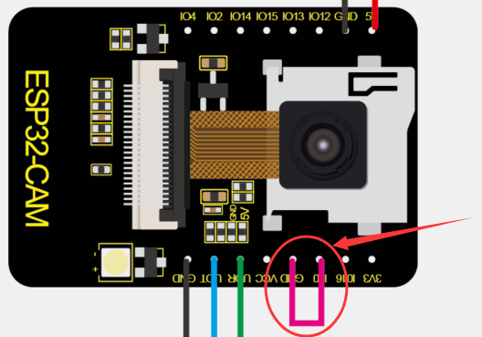

# **KS5001 ESP32-CAM Development Board WiFi+Bluetooth Module**

**with OV2640 Camera (Black and Eco-friendly)**

**Description**

ESP32-CAM has a very competitive small-sized camera module in the
industry. It can work independently as the smallest system, with a size
of only 27\*40.5\*4.5mm, and a deep sleep current as low as 6mA.

ESP-32CAM can be widely used in various IoT applications, home smart
devices, industrial wireless control, wireless monitoring, QR wireless
identification, wireless positioning system signals and other IoT
applications.

ESP-32CAM adopts DIP sealed package and can be used directly by plug-in,
realizing the rapid production of products, providing customers with
high-reliability connection methods, in support for various IoT hardware
terminal occasions.

Adopt low-consumption, double core 32 bit CPU, can be taken as a
application processor.

The main frequency is up to 240MHz, and the computing power reaches to
600 DMIPS.

Built-in 520 KB SRAM，external 8MB PSRAM.

Compatible with UART/SPI/I2C/PWM/ADC/DAC ports.

Support OV2640 and OV7670 cameras，with a built-in flashing light.

Support TF card, multiple sleep modes, WIFI upload and STA/AP/STA+AP
working mode.

Built-in Lwip and FreeRTOS.

Support Smart Config/AirKiss smart config.

Support second development.

**Parameters:**

Power supply range: 5V

Working current: 2A

Deep sleep current: 6mA

Product size: 27mm \* 40.5mm

**Connection Diagram**

|                      |                                                                      |     |
| -------------------- | -------------------------------------------------------------------- | --- |
| USB to Serial Module | ESP32-CAM Development board WiFi+Bluetooth Module with OV2640 Camera | UNO |
|                      | VCC                                                                  | 5V  |
| GND                  | GND                                                                  | GND |
| TXD                  | UOR                                                                  |     |
| RXD                  | UOT                                                                  |     |

Step 1: wire up the USB to serial module and ESP32-CAM development board

Step 2: Insert the camera and a SD card into the ESP32-CAM development
board, and interface the external power wire of the ESP32-CAM board with
the control board. (USB cable can’t supply large current to drive the
development board, thus, the external power more than 5V 500mA is
needed.)

Step 3：Connect the external DC power to the control board, MINI USB to
the USB to serial module

**Set up the test environment：**

If you find  in the board type of the Arduino
IDE, you can skip to set up the environment.

**Configure esp32：Go to** Arduino--\>File--\>Preferences +comma，

Configure ESP url

Copy“https://dl.espressif.com/dl/package\_esp32\_index.json”to
“Additional Board Manager URLs”

**Configure the development board：**Open **Tools**--\>Board:“Arduino
UNO”--\>Boards Manager）

Search esp32 to select the version and install it;）

If the installing is successful, you can find ESP32 Wrover Module, as
shown below;

**Programming**

Step 1: Through the short circuit between IO0 and GND on ESP32-CAM
board, the module is activated to program.

Step 2：make sure the parameters of serial port and board type correct

**Select sample**

Modify the camera type: change into esp32-cam

Configure WiFi:

Compile:

Click  and the IDE shows
**connecting....\_\_\_\_\_\_ ,** then press the reset button of the
ESP32-CAM board to upload test code

If the IDE shows the following picture as follows, the test code is
uploaded successfully.

After programming, open serial monitor in the upper right corner of the
Arduino.

**Test**

Select 11500 baud rate, remove IO0 and GND wire. Press reset button, LED
indicator will flash. If fail to connect WiFi, press the reset button
again.

Step 1: connect the computer to the development board though WiFi, and
paste the above displayed IP address in the searching box of Google or
Foxfire browser. (Other browsers may not compatible)

Step 2: set the parameters as follows and click **Start Stream.** Then
the camera will start work, the WiFi module will heat and serial port
will display numerous communication data. You don’t need to worry about.

**Test Result**

The video screen will appear

Note: IP address should be displayed normally on serial monitor, the
camera should be wired up and video screen is clear.

**Note:**

1.  The input power is least 5V 2A; otherwise pictures will show
    abnormally
    
    2\. ESP32 GPIO32 pin controls the power of the camber; when the
    camera works, pull down GPIO32.
    
    3\. As IO0 is connected to XCLK, hang the IO0 and avoid connecting
    high or low levels when using it.

<!-- end list -->

4.  The default firmwares are included when delivered from factory, yet
    we don’t provide the way to download them. Please be cautious about
    operation if programming other firmwares.

**More tutorials：**

https://aithinker.blog.csdn.net/article/details/108000974

